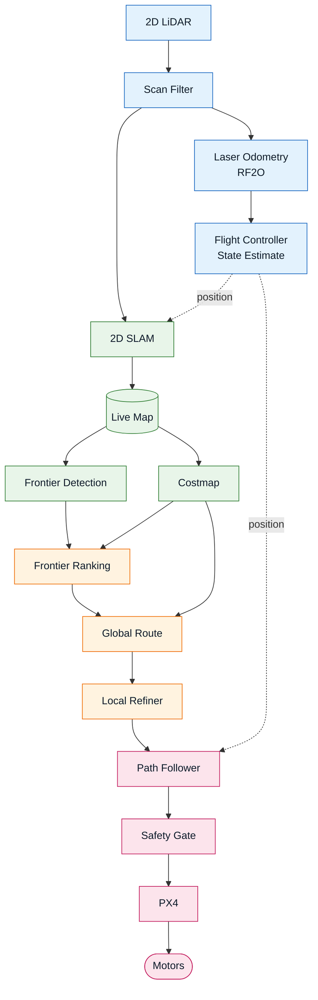

# Autonomous Exploration and 2D Mapping on a Drone

A quadrotor that explores an unknown indoor space **without GPS**, builds a live 2D map as it
goes, and decides where to fly next on its own.

Built on ROS 2 and PX4. Everything below runs today in simulation; the target platform is a
Raspberry Pi 5 paired with a Cube Orange flight controller.

> **About this repository.** This is a showcase of work in progress. The project is an entry in an
> ongoing competition, so the source code is kept private until the competition concludes — what
> is published here is the demo footage, the design, and the current status. Happy to walk through
> the implementation in person or on a call.

---

## Demo

---

## The arena

A randomly generated indoor maze in Gazebo. The drone starts in one cell with no prior map, no
GPS, and no knowledge of the layout.

---

## The vehicle

An X500 quadrotor carrying a 360° 2D LiDAR — the only sensor the navigation stack depends on.

---

## Pipeline

Two connections are easy to miss and matter a lot: the laser odometry is what gives the flight
controller a position at all indoors, and the map feeds **both** the costmap and frontier
detection.

---

## The blocks

| Block | What it does |
|---|---|
| **Scan Filter** | Drops out-of-range LiDAR returns, so the odometry is never fed a phantom wall where there was simply no echo. |
| **Laser Odometry** | Matches each scan against the previous one to estimate how far and which way the drone moved. |
| **Flight Controller State Estimate** | Fuses that motion estimate as the drone's position. This is what makes stable flight possible with no GPS. |
| **2D SLAM** | Builds the occupancy map and keeps correcting it as more of the space is observed. |
| **Costmap** | Grows every obstacle by the drone's own half-width and adds a gradient away from walls, so routes prefer the middle of a corridor. |
| **Frontier Detection** | Finds the boundaries between explored and unexplored space — the candidate places to go next. |
| **Frontier Ranking** | One sweep outward from the drone gives the true travel cost to every frontier; the closest useful one is chosen and held. |
| **Global Route** | A path to that frontier which prefers long straights and clean turns, planned once and flown to its end rather than re-derived every cycle. |
| **Local Refiner** | Watches the few metres ahead and detours around obstacles that appeared after the route was planned, rejoining the original path afterwards. |
| **Path Follower** | Converts the route into position targets the flight controller tracks, slowing down when it drifts off rather than cutting the corner. |
| **Safety Gate** | The last check before the flight controller: brakes for obstacles the drone is actively closing on. |

---

## Built with

ROS 2 Jazzy · PX4 (SITL and the real autopilot) · Gazebo · `slam_toolbox` · `rf2o_laser_odometry`
· `laser_filters` · Python, NumPy and SciPy for every custom node.

The whole stack has to share a Raspberry Pi 5 with the perception workload later on, so every
custom node is deliberately small — plain NumPy grids and sweeps rather than a heavyweight
navigation framework.

---

## Status

**Working in simulation:** GPS-denied flight, live 2D mapping, autonomous frontier exploration,
route planning and path following, local obstacle avoidance, return-to-home, and automatic
detection of when exploration is finished.

---

## References

- B. Yamauchi, *A Frontier-Based Approach for Autonomous Exploration*, IEEE CIRA, 1997 — the
  frontier-exploration idea this stack is built around.
- M. Jaimez, J. G. Monroy, J. Gonzalez-Jimenez, *Planar Odometry from a Radial Laser Scanner: A
  Range Flow-based Approach*, ICRA, 2016 — the RF2O laser odometry.
- S. Macenski, I. Jambrecic, *SLAM Toolbox: SLAM for the dynamic world*, Journal of Open Source
  Software, 2021.
- [PX4 Autopilot](https://px4.io/) — flight control and state estimation.
- Costmap inflation follows the layered-costmap model used by
  [Nav2](https://docs.nav2.org/configuration/packages/costmap-plugins/inflation.html).
